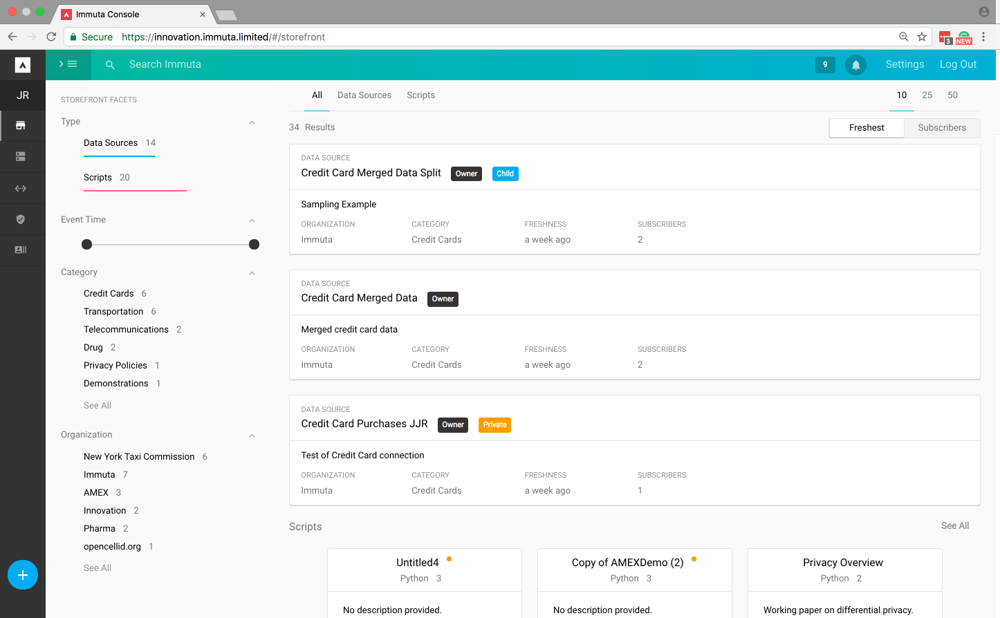

# Connecting Immuta to Analytics Tools

## Introduction

This document will serve as a living primer to help analysts and data scientists a
guide on how Immuta can be connected to various tools used by data scientists,
business analysts, and other analytics professionals.  In this document we will
attempt to enumerate the steps required to connect to data science tools to
expose Immuta data stores.

Immuta enables remote connection to the Immuta datastore through a PostgreSQL queries.
In principle any tool which can connect to a PostgreSQL database can access the Immuta data.

## Getting Started
In order to connect to the Immuta datastore, we must first identify the connection string.

Sign into the Immuta Console, shown below

