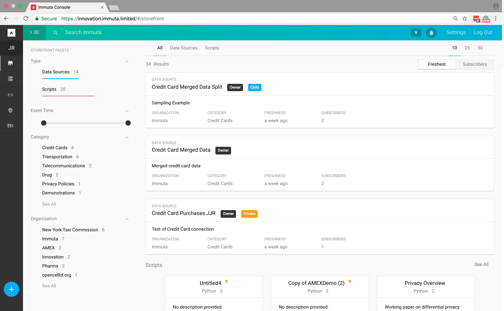
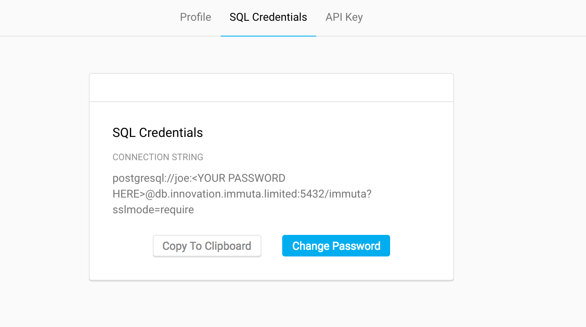
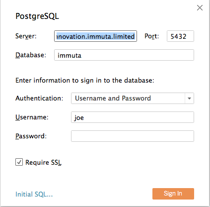
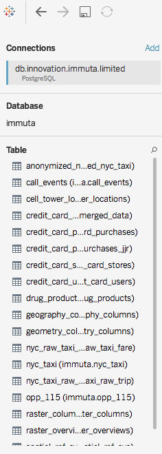
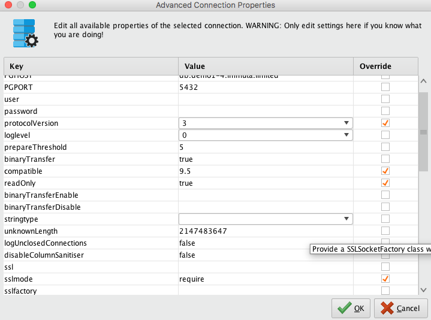
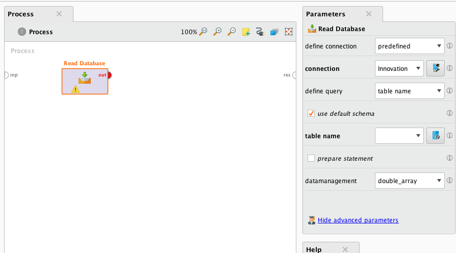

# Connecting Immuta to Analytics Tools

## Introduction

This document will serve as a living primer to help analysts and data scientists a
guide on how Immuta can be connected to various tools used by data scientists,
business analysts, and other analytics professionals.  In this document we will
attempt to enumerate the steps required to connect to data science tools to
expose Immuta data stores.

Immuta enables remote connection to the Immuta datastore through a PostgreSQL queries.
In principle any tool which can connect to a PostgreSQL database can access the Immuta data.

## Getting Started
In order to connect to the Immuta datastore, we must first identify the connection string.

1. Sign into the Immuta Console, shown below


2. Select your initials on the upper left hand corner of the GUI.  In the case here **JR**

3. Select **SQL Credentials**


4. If you have not set a password, select **Change Password**.  

5. Copy the connection string and remember the password you set.

Now we have the basic connection information needed to connect to a tool.

## Python 2.7 and 3.x Using SQLAlchemy and Pandas Dataframes

**SQLAlchemy** is the Python SQL toolkit to connect and query SQL databases.  This package
will form the primary interface to query the source data.  **Psycopg2** is a popular
PostgreSQL adapter for Python.  This is will provide the drivers needed to connect to the
Immuta data store.  Finally **Pandas** is a high performance data structurs and data
analysis toolkit which will hold the results of any query on the Immuta data store.
Connecting to the Immuta data store will require installing all of these packages:

1. Install the required packages.  If you are using pip execute the following command:

`pip install sqlalchemy psycopg2 pandas`

2. Now launch python 2.7 or 3.x
3. We now need to create an SQLAlchemy Engine.  The engine package
defines the basic components used to interface DB-API modules with
higher-level statement construction, connection-management, execution,
 and result contexts.  The following code can be used to
 create the SQLAlchemy Engine:

 ```
import sqlalchemy as sq
import psycopg2 as pg
import getpass
user_name = 'joe' # Enter your username here
host_name = 'db.innovation.immuta.limited'
port_number = 5432
db_name = 'immuta'

def MakeConnectionString(user_name, host_name,
                         port_number, db_name):
    password = getpass.getpass()
    connection_string = "postgresql://%s:%s@%s:%i/%s?sslmode=require"%(user_name,
                                                                      password,
                                                                      host_name,
                                                                      port_number,
                                                                      db_name)
    return(connection_string)

engine = sq.create_engine(MakeConnectionString(user_name, host_name, port_number,
                                              db_name))
```
4. You can now examine the tables which have been exposed to you using the
SQLAlchemy inspector object:

```
inspector = sq.inspect(engine)
## Look at the available source tables
inspector.get_foreign_table_names()
```

The list of tables returned from the ``get_foreign_table_names``
will match the list of tables which are exposed to you in Immuta.

5. Read a table into a Pandas data frame.  This can be done
several ways but here are a few methods:

```
# create a connection
conn = engine.connect()

# Query the table through Pandas
df_pandas = pd.read_sql("SELECT * FROM credit_card_merged_data", conn)

# Use SQLAlchemy to query the table directory and fold
# the results into pandas
query = conn.execute('SELECT * FROM credit_card_merged_data')
df_sql = pd.DataFrame(query.fetchall(), columns=query.keys())

# Close the connection
conn.close()
```
## R and RStudio

As with Python, R has libraries to interface with a PostgreSQL data source.  
These libraries include **RODBC** and **RPostgeSQL**.  This document will
detail how **RODBC** can be used to connect to Immuta data sources.

Prior to installing **RODBC**, Postgres ODBC Drivers must be installed on
your system, and ODBC datasources must be setup.  There are step by step
guides on doing this in Windows ()
and Mac ().

Once installed the **odbc.ini** file will need to be edited to
enable connections to Immuta.  This can be done either globally
at **/usr/local/etc/odbc.ini** or locally at **~/odbc.ini**.  Add
the Immuta connection to the **odbc.ini** file by adding the following
passage:

```
[ODBC Data Sources]
immuta = Immuta Innovation
local = Local Postgres

[immuta]
Driver = PostgreSQL
ServerName = <immuta server name>
Port = 5432
Database = immuta
Username = <your user name>
Password = <your password>
Protocol = 9.5
Debug = 1
SSLMode = require
```

The Immuta server name and your Immuta user name can be seen in
the SQL Credential screen discussed in the **Getting Started** section.

Once this is edited install **RODBC** using the following command
from the command line:

```
$ R CMD INSTALL RODBC_1.3-8.tar.gz
```

Now launch either **R** or **RStudio** and execute the following
commands:

```
library("RODBC")
odbcDataSources()
```

This should show "immuta" as an available datasource.  

```
# Open a connection to Immuta
ch <- odbcConnect("immuta")
## Show available tables
sqlTables(ch)
## Fetch a table
df <- sqlFetch(ch, <table name>, max=100)
## Close the connection
close(ch)
```
## Tableau

Tableau can query the Immuta data store using the **Connect** menu.  
Under the **To a Server** menu select **PostgreSQL**.  This launch
a menu, shown below, to enter the Immuta server, port, database, user
name and password.  Please make sure to check **Require SSL**.



After connecting to Immuta, Tableau will present a list of available
data sources from the Immuta data store.



Select any of the available tables and drag them into the
**Drag tables here** frame.  From here it is possible to join tables,
filter rows, and define selections.  Once you have a defined
table select **Update Now**.  This will draw data from Immuta.  

Additional information on connecting Tableau and Immuta can
be found here,


## RapidMiner

RapidMiner database connections are detailed here:
[RapidMiner Database](http://docs.rapidminer.com/server/administration/creating-connections/creating-db-conns.html).  
In this be sure to set **SSL Mode** to **require**.  This can be done
under the **Advanced** connection properties tab, shown below.  Find the
**sslmode** key and set the value to **require**, as well as checking
the **Override** column.  Once this is done, select **Test** to
make sure the connection is ok.



Select **Database** under the **Data Access** tab in the **Operators**
menu.  Drag the **Read Database** operator into the process screen.  

Select the **Read Database** operator in the **Process** frame,
this will the **Parameters** tab for the database.  In the
**Parameters** frame select the Immuta connection.  It is
then possible to query the database or select a table, however
RapidMiner does not appear to prepopulate the complete list
of Immuta Tables.  That being said it is possible to just enter
the Immuta table name and have RapidMiner ingest the data.



## TODO: GOOGLE SHEETS w/ KLOUDIO

## TODO: GOOGLE SHEETS w/ ZAPIER

## TODO: EXCEL

## TODO: MATLAB

## TODO: STATA

## TODO: SAS
